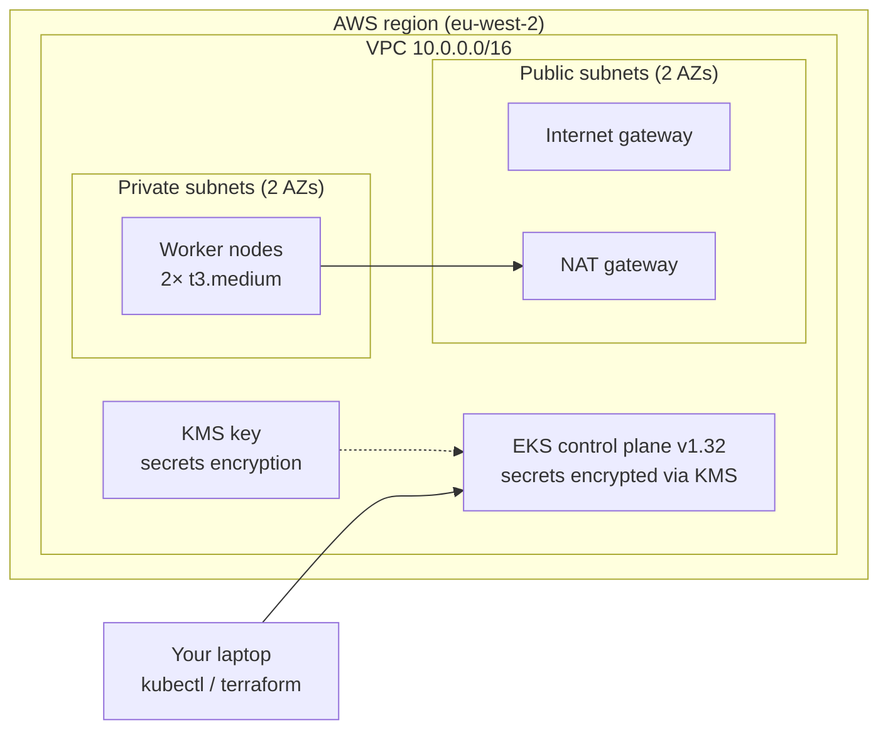

# eks-project

A production-shaped Amazon EKS cluster provisioned with Terraform, built from official community modules, with security scanning and pre-commit automation. This repository demonstrates Infrastructure as Code practices end to end: modular composition, version pinning, secure-by-default networking, secrets encryption, and a quality gate that runs on every commit.

## Table of contents

- [Overview](#overview)
- [Architecture](#architecture)
- [Repository layout](#repository-layout)
- [Design decisions](#design-decisions)
- [Prerequisites](#prerequisites)
- [Usage](#usage)
- [Security posture](#security-posture)
- [Tooling and quality gates](#tooling-and-quality-gates)
- [Cost management](#cost-management)
- [Roadmap](#roadmap)

## Overview

This project provisions a highly available Kubernetes cluster on AWS EKS entirely through Terraform. Rather than hand-writing the dozens of low-level resources an EKS cluster requires, it composes the official `terraform-aws-modules/vpc` and `terraform-aws-modules/eks` modules, which encode networking, IAM, and encryption to industry best practice and attach the correct policies automatically.

| Property | Value |
|----------|-------|
| Region | eu-west-2 (London) |
| Kubernetes version | 1.32 |
| Node group | Managed, 2× t3.medium |
| Autoscaling | min 1 / desired 2 / max 3 |
| Node placement | Private subnets, two availability zones |
| State | Local (remote backend planned — see roadmap) |

## Architecture



Traffic flow in brief: the worker nodes sit in private subnets and reach the internet (for image pulls and updates) outbound-only via the NAT gateway in the public subnets. The EKS control plane is managed by AWS; its API endpoint is reachable from the operator's machine for `kubectl` access. A dedicated KMS key encrypts Kubernetes secrets at rest.

## Repository layout

The configuration is split into purpose-named files rather than a single `main.tf`. Terraform loads every `.tf` file in the directory and resolves dependencies automatically, so the split is purely for human readability.

| File | Purpose |
|------|---------|
| `versions.tf` | Pins the required Terraform version and the AWS provider version (`~> 5.0`), so the project behaves identically across machines and CI. |
| `provider.tf` | Configures the AWS provider. Region is read from a variable; credentials are sourced from the environment, never hardcoded. |
| `variables.tf` | Declares typed input variables with defaults: `aws_region`, `cluster_name`, `vpc_cidr`. |
| `vpc.tf` | Calls the official VPC module to build the VPC, public and private subnets across two AZs, NAT gateway (single, for cost), and internet gateway. |
| `eks.tf` | Calls the official EKS module: control plane, managed node group, all required IAM roles and policies, KMS secrets encryption, and full control-plane logging. |
| `.checkov.yaml` | Checkov configuration, including documented suppressions for consciously-accepted findings. |
| `.pre-commit-config.yaml` | Orchestrates `terraform fmt`, `terraform validate`, `tflint`, and `checkov` on every commit. |

## Design decisions

**Official modules over hand-rolled resources.** The EKS module attaches the four IAM policies a working node group needs (`AmazonEKSWorkerNodePolicy`, `AmazonEKS_CNI_Policy`, `AmazonEC2ContainerRegistryReadOnly`, and the cluster's `AmazonEKSClusterPolicy`) automatically, along with security groups and the OIDC provider. Composing maintained modules is both less error-prone and the more senior choice than reimplementing this surface by hand.

**Version pinning everywhere.** Terraform core, the AWS provider, and both modules are pinned. The provider lock file (`.terraform.lock.hcl`) is committed so resolved provider versions are reproducible.

**Variables over hardcoded values.** Region, cluster name, and CIDR are variables with sensible defaults, so the same configuration can target a different region or be overridden in CI without editing the code.

**Single NAT gateway.** A single shared NAT gateway is used instead of one per AZ. This trades a little resilience for materially lower cost, which is the right call for a learning and demonstration environment.

## Prerequisites

- An AWS account with credentials configured via `aws configure` (an IAM user, not root).
- Terraform ≥ 1.3.
- `kubectl`, `helm`, and the AWS CLI v2 installed.
- For the quality gate: `tflint`, `checkov`, and `pre-commit`.

## Usage

```bash
# Initialise providers and modules
terraform init

# Validate and review before applying
terraform validate
terraform plan -out=tfplan

# Apply the reviewed plan exactly
terraform apply tfplan

# Connect kubectl to the new cluster
aws eks --region eu-west-2 update-kubeconfig --name ismael-eks
kubectl get nodes

# Tear down to stop incurring cost
terraform destroy
```

Provisioning takes roughly 15 minutes (the control plane alone is ~10). Using `terraform plan -out=tfplan` followed by `terraform apply tfplan` guarantees the applied changes are exactly the reviewed ones.

## Security posture

| Control | Implementation |
|---------|----------------|
| Secrets encryption | Kubernetes secrets encrypted at rest with a dedicated KMS key; key rotation enabled. |
| Network isolation | Worker nodes in private subnets with no public IPs; outbound-only internet via NAT. |
| Control-plane logging | All log types enabled: api, audit, authenticator, controllerManager, scheduler. |
| Instance metadata | IMDSv2 required on worker nodes (mitigates credential theft via SSRF). |
| Credential hygiene | No AWS keys in code; provider reads from the environment. |

## Tooling and quality gates

Two complementary static-analysis tools run automatically before every commit, wired together by the `pre-commit` framework:

- **`terraform fmt`** — canonical formatting.
- **`terraform validate`** — syntax and internal consistency.
- **TFLint** — Terraform-specific linting (deprecated syntax, invalid arguments).
- **Checkov** — security and compliance scanning against benchmark policies.

Checkov runs with `--download-external-modules`, so it inspects the module internals, not just the wrapper. Findings were triaged rather than blanket-silenced: real issues (e.g. enabling all control-plane log types) were fixed in code, while consciously-accepted findings are suppressed in `.checkov.yaml` with a documented reason each — for example, the public cluster endpoint (intentional for local `kubectl` access in this environment) and a verified false positive on secrets encryption (the module configures it via dynamic blocks the static scanner cannot resolve).

## Cost management

This is a learning environment, so cost control is deliberate:

- A single NAT gateway rather than one per AZ.
- `t3.medium` nodes with a desired count of 2.
- `terraform destroy` between sessions — the configuration rebuilds the entire environment identically in ~15 minutes, so there is no reason to leave it running idle.
- An AWS Budget and Cost Anomaly Detection monitor guard against surprise spend.

## Roadmap

- [ ] Remote state backend (S3 bucket + DynamoDB lock table), bootstrapped separately.
- [ ] Containerise a sample application and push to Amazon ECR.
- [ ] Deploy the application with Helm.
- [ ] GitHub Actions CI/CD pipeline running the same fmt/validate/lint/scan gate.
- [ ] Observability stack: Prometheus and Grafana.
